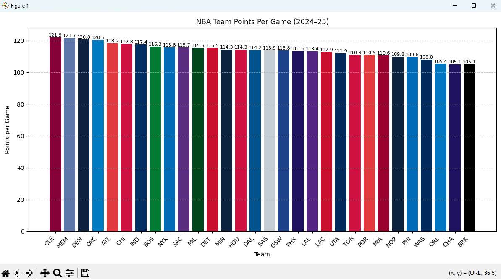
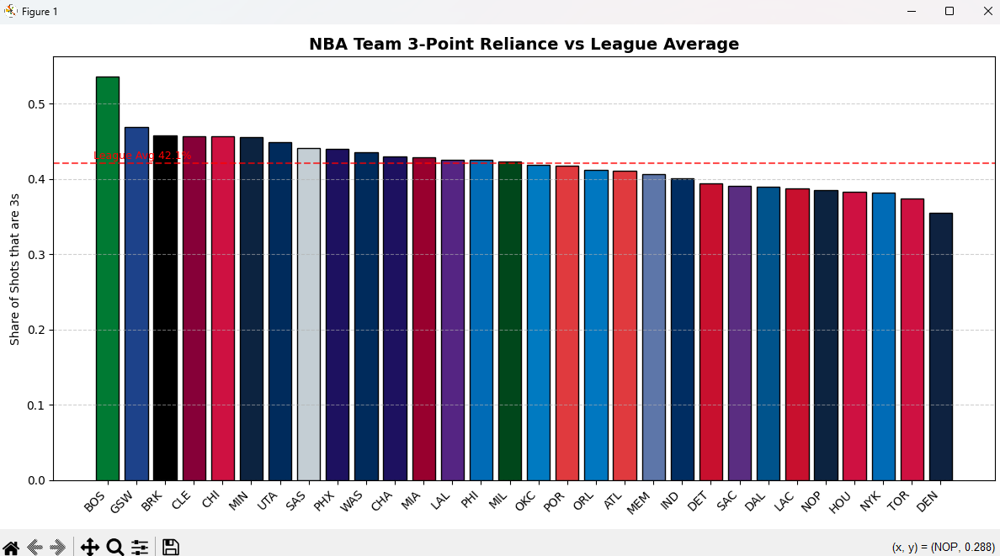

  

<h1 align="center">JTC_AISE_FALL_2025</h1>

Notes, practice exercises, and projects from **Columbia University's Justice Through Code – AISE (Flagship) Program, Fall 2025**.  

---

## 📖 Table of Contents
- [Practice Folder](practice) – 💡 contains this week’s homework & exercises
  - [Pandas Homework](practice/pandas_practice.py) – NBA Team Stats analysis
  - [Assets](practice/assets) – generated charts & outputs

---

## 📝 About
This repo is a record of my journey through the AISE (Flagship) program, building on my experience in the Tech Pathways program.  
It will include Python practice, advanced data science, machine learning, and project work.

---

## 🛠️ Skills Practiced
- Python fundamentals & advanced problem solving  
- Data cleaning and preprocessing  
- Pandas & NumPy for analysis  
- Matplotlib for visualization  
- Statistics & probability  
- SQLite for data storage  
- Machine learning foundations with scikit-learn  
- Advanced projects for AISE capstone prep  

---

## ⚙️ Tech Stack
- Python 3.x  
- Pandas, NumPy, Matplotlib, scikit-learn  
- SQLite & data tools  

---

## 📌 Notes
Sensitive files (API keys, datasets, .env) are excluded via `.gitignore`.  

---

## 📊 Current Homework – Pandas NBA Team Stats

This week’s assignment was **Pandas practice**.  
I used NBA team per-game stats (2024–25 season) to practice:

- Cleaning the dataset (removed playoff stars, dropped “League Average” row)  
- Renaming columns for clarity (`points`, `rebounds`, etc.)  
- Checking for missing values & outliers  
- Printing Top 5 & Bottom 5 scoring teams  
- Visualizing results with Matplotlib + team colors  
- Sept 2025: Added 3-Point Reliance analysis to `pandas_practice.py`
- Sept 2025: Cleaned practice folder and organized assets

### 📈 Visualization

  

---

### 🏀 3-Point Reliance

  

---

## 🐼 Pandas Tutorials (Getting Started)

I’m also working through the official **Pandas Getting Started tutorials** step by step  
(using the Titanic dataset). This lives in a Jupyter Notebook:

- [pandas_tutorial.ipynb](practice/pandas_tutorial.ipynb)

### Progress so far
- ✅ Module 1 – Intro / What kind of data Pandas handles
- ✅ Module 2 – Reading & writing CSVs
- ✅ Module 3 – Selecting subsets of data
- ✅ Module 4 – Creating plots
- ⏳ Module 5+ – Coming soon

## 🌐 Links
- [Justice Through Code Program](https://justicethroughcode.org/)  
- [Columbia University](https://www.columbia.edu/)  

---

  

