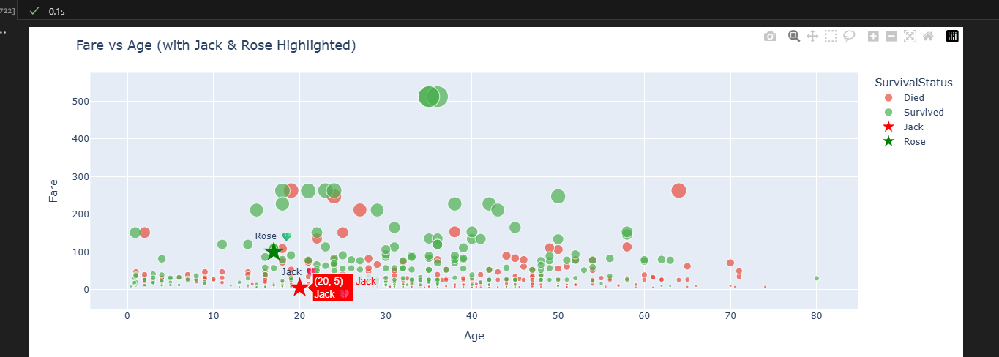
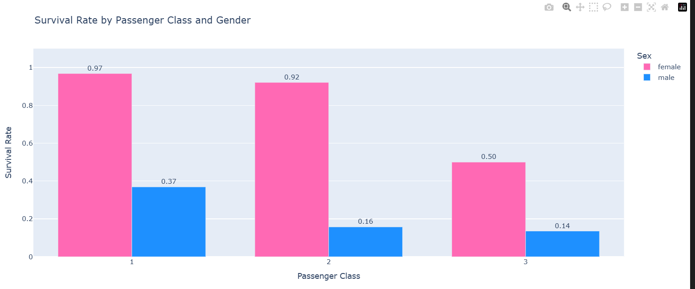
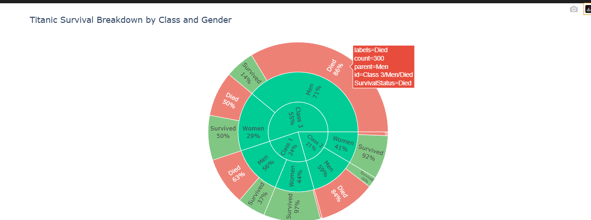

  

<h1 align="center">JTC_AISE_FALL_2025</h1>

Notes, practice exercises, and projects from **Columbia University's Justice Through Code – AISE (Flagship) Program, Fall 2025**.  

---

## 📖 Table of Contents
- [Practice Folder](practice) – 💡 weekly homework & exercises
  - [pandas_tutorial.ipynb](practice/pandas_tutorial.ipynb) – Pandas Getting Started (Titanic dataset)
  - [pandas_practice.py](practice/pandas_practice.py) – NBA Team Stats analysis
  - [Assets](practice/assets) – generated charts & outputs

---

## 📝 About
This repo is a record of my journey through the AISE (Flagship) program, building on my experience in the Tech Pathways program.  
It will include Python practice, advanced data science, machine learning, and project work.

---

## 🛠️ Skills Practiced
- Python fundamentals & advanced problem solving  
- Data cleaning and preprocessing  
- Pandas & NumPy for analysis  
- Matplotlib for visualization  
- Statistics & probability  
- SQLite for data storage  
- Machine learning foundations with scikit-learn  
- Advanced projects for AISE capstone prep  

---

## ⚙️ Tech Stack
- Python 3.x  
- Pandas, NumPy, Matplotlib, scikit-learn  
- SQLite & data tools  

---

## 📌 Notes
Sensitive files (API keys, datasets, .env) are excluded via `.gitignore`.  

---

## 📊 Current Homework – Pandas NBA Team Stats

This week’s assignment was **Pandas practice**.  
I used NBA team per-game stats (2024–25 season) to practice:

- Cleaning the dataset (removed playoff stars, dropped “League Average” row)  
- Renaming columns for clarity (`points`, `rebounds`, etc.)  
- Checking for missing values & outliers  
- Printing Top 5 & Bottom 5 scoring teams  
- Visualizing results with Matplotlib + team colors  
- Sept 2025: Added 3-Point Reliance analysis to `pandas_practice.py`
- Sept 2025: Cleaned practice folder and organized assets

### 📈 Visualization

  

---

### 🏀 3-Point Reliance

  

---

## 🐼 Pandas Tutorials – Getting Started (Titanic Dataset)

I worked through the official **Pandas Getting Started tutorials** step by step using the Titanic dataset.  
All work is inside a Jupyter Notebook:  
📓 **[practice/pandas_tutorial.ipynb](practice/pandas_tutorial.ipynb)**  

### Progress
- ✅ Module 1 – Intro / What kind of data Pandas handles  
- ✅ Module 2 – Reading & writing CSVs  
- ✅ Module 3 – Selecting subsets of data  
- ✅ Module 4 – Creating plots  
- ✅ Module 5–10 – Completed (grouping, reshaping, missing data, etc.)  

### Visualizations Included
- Survival by class and gender (pink/blue bar chart)  
- Age distribution by survival (histogram)  
- Survival breakdown (sunburst with Class → Gender → Survival)  
- Fare × Age bubble chart (with Jack & Rose highlighted ⭐)  

Each chart also has an **Insight block** explaining the results.  

💡 At the end, I also created some **extra visuals just for fun** — like highlighting Jack & Rose in the dataset and building interactive Plotly charts — to practice making the analysis more engaging. Here are my 3 favorites!

**Fare vs Age (Jack & Rose)**  

**Survival by Gender**  

**Pie Chart**  

---

## 🌐 Links
- [Justice Through Code Program](https://centerforjustice.columbia.edu/justicethroughcode)  
- [Columbia University](https://www.columbia.edu/)  

---

  

